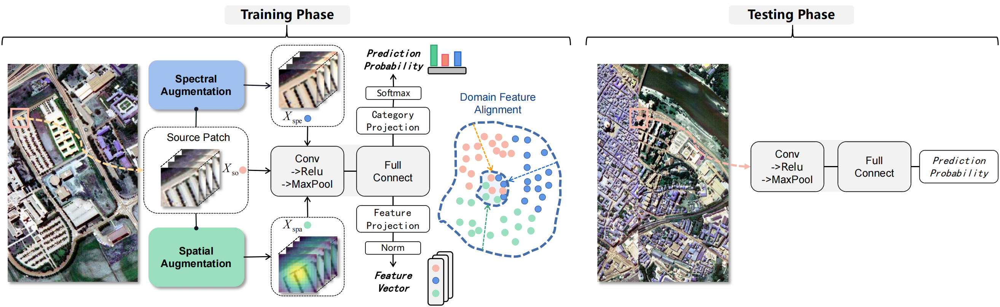

# Spatial-Spectral Linear Extrapolation for Cross-Scene Hyperspectral Image Classification

<p align='center'>
  
</p>

## Abstract

In realistic hyperspectral image (HSI) cross-scene classification tasks, it is quite ideal to obtain target domain samples during the training phase. Therefore, the model needs to be trained on one or more source domains (SD) and achieve robust domain generalization (DG) performance on an unknown target domain (TD). Popular DG strategies constrain the model's predictive behavior in synthetic space through deep, nonlinear source expansion. However, recent studies have shown that there is asymmetry in the activation functions of neurons in the network for different categories, resulting in learning task-irrelevant features when learning task-related features (called "feature contamination"). To alleviate this problem, this study replaces the common nonlinear generative network with a specific linear projection transformation to reduce the number of neurons activated nonlinearly during training and alleviate the learning of contaminated features. Specifically, this study proposes a dimensionally decoupled spatial spectral linear extrapolation (SSLE) strategy to achieve sample regularization. Inspired by the weakening effect of water vapor absorption and Rayleigh scattering on band reflectivity, we simulate common spectral drift based on Markov random fields to achieve linear spectral extrapolation. Further considering the common co-occurrence phenomenon of patch images in space, we design spatial weights combined with the label determinism of the center pixel to construct linear spatial extrapolation. Finally, in order to ensure the cognitive unity of the high-level features of the discriminator in the sample space, we use inter-class contrastive learning to align the back-end feature representation. Extensive experiments are conducted on three datasets, including ablation studies, performance comparisons, and in-depth analysis. The results show that SSLE is effective in cross-scene classification tasks, outperforming basic hybrid strategies and performing comparable to advanced nonlinear expansion algorithms. In particular, on the Houston18/Shanghai datasets, its overall accuracy is 0.51\%/0.83\% higher than the best results of other methods, and its Kappa coefficient is 0.78\%/2.07\% higher, respectively.


## Requirements

CUDA Version: 11.7

torch: 2.0.0

Python: 3.10

## Dataset

The dataset directory should look like this:

```bash
datasets
├── Houston
│   ├── Houston13.mat
│   ├── Houston13_7gt.mat
│   ├── Houston18.mat
│   └── Houston18_7gt.mat
└── Pavia
    ├── paviaC.mat
    └── paviaC_7gt.mat
    ├── paviaU.mat
    └── paviaU_7gt.mat

```

## Usage

1.You can download [Houston &amp; Pavia](https://drive.google.com/drive/folders/1No-DNDT9P1HKsM9QKKJJzat8A1ZhVmmz?usp=sharing) dataset here.

2.Run the following command:


Prepare synthetic samples in advance：
```
python Augmentation_H13.py
python Augmentation_PU.py
```

Train on Houston dataset:
```
python train.py --data_path ./datasets/Houston/ --source_name Houston13 --target_name Houston18 --re_ratio 5 --training_sample_ratio 0.8 --flip_augmentation --radiation_augmentation
```
Train on Pavia dataset:
```
python train.py --data_path ./datasets/Pavia/ --source_name paviaU --target_name paviaC --re_ratio 1 
```

