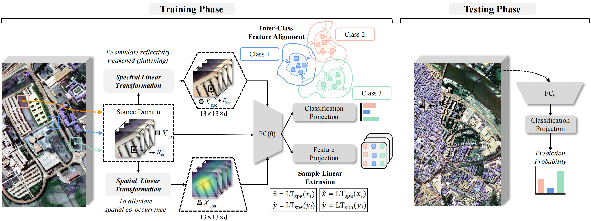

# Invariance-Driven Non-parametric Covariate Expansion for Cross-Scene Hyperspectral Image Classification

<p align='center'>
  
</p>

## Abstract

The difficulty of generalizing to unknown domains for cross-scene HSI classification tasks can be described as dataset shift, which primarily involves covariate shift caused by varied imaging conditions and equipments, and the prior probability shift such as class imbalance problem from variety of scenarios. While sampling the nearest neighbor distribution to expand the coverage of the training domain is a common strategy for addressing covariate shift, it is challenging to obtain controllable and interpretable virtual samples under the integration of spatial and spectral for hyperspectral images. Inspired by the diverse expressions of natural images, this paper propose a non-parametric method for producing hyperspectral "sketch description" to expand patches-based training sample space, including developing a model to create a downsampling approximation of spectral data while preserving the original spectrum's absorption characteristics, and assigning space differential weights for emphasizing the dominance of central pixel. Besides, to ensure that the real and virtual data have close invariant feature representation, supervised contrastive learning is employed to optimize the feature extraction network. Finally, considering the preceding sample synthesis is a one-to-one covariate expansion that maintain original label distribution, for legacy prior probability shift, we adopt and simplify the standard focal loss as a regularization term. Extensive experiments on three public datasets demonstrate that the proposed method achieve comparable or even better results than current state-of-the-art approaches in generalization performance.


## Requirements

CUDA Version: 11.8

torch: 2.0.0

Python: 3.8

## Dataset

The dataset directory should look like this:

```bash
datasets
├── Houston
│   ├── Houston13.mat
│   ├── Houston13_7gt.mat
│   ├── Houston18.mat
│   └── Houston18_7gt.mat
└── Pavia
    ├── paviaC.mat
    └── paviaC_7gt.mat
    ├── paviaU.mat
    └── paviaU_7gt.mat

```

## Usage

1.You can download [Houston &amp; Pavia](https://drive.google.com/drive/folders/1No-DNDT9P1HKsM9QKKJJzat8A1ZhVmmz?usp=sharing) dataset here.

2.You can change the `source_name` and `target_name` in train.py to set different transfer tasks.

3.Run the following command:

Houston dataset:
```
python train.py --data_path ./datasets/Houston/ --source_name Houston13 --target_name Houston18 --re_ratio 5 --dim1 128 --dim2 8 --flip_augmentation --radiation_augmentation
```
Pavia dataset:
```
python train.py --data_path ./datasets/Pavia/ --source_name paviaU --target_name paviaC --re_ratio 1 --dim1 8 --dim2 16 --flip_augmentation --radiation_augmentation
```

